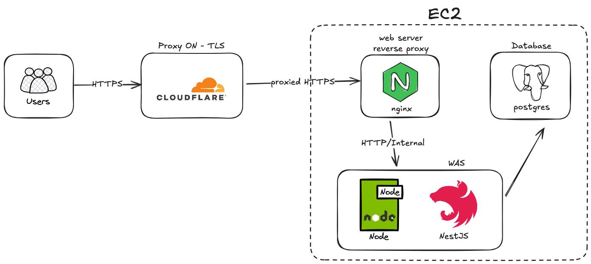

## 도메인

https://www.sera-kim.shop

## 시스템 아키텍쳐



## 유닛 테스트 결과


## 진행사항

1. 테스트 자동화 정비
   1. 구독 서비스 프로젝트 생성
      - [x] 회원가입
      - [x] 로그인
      - [x] 내 정보확인(+구독정보)
      - [x] 구독 상품 조회
      - [ ] 구독 상품 구매
      - [ ] 구독 상품 환불
   2. Jest + Supertest로 **단위 테스트/통합 테스트 작성**
   3. GitHub Actions에서 **테스트 자동화 파이프라인** 추가
   4. Coverage 리포트(`jest --coverage`)까지 CI에 연결
   5. 최종 정리: "테스트 커버리지 + CI 연동" 결과 첨부 예정

## Description

유저가 월간/연간 상품을 결제 후 구독권이 생성되는 시스템을 만든 백엔드 서버입니다.

## Installation

```bash
yarn install
```

## Running the app

```bash
yarn run start:prod
```

## Test

jest-mock-extended : 모의 객체를 생성해주는 패키지

```bash
# unit tests
$ yarn run test

# e2e tests
$ yarn run test:e2e

# test coverage
$ yarn run test:cov
```
